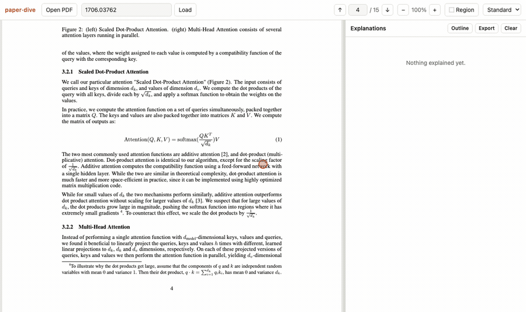

<h1 align="center">paper·dive</h1>

<p align="center">
  Read a paper. Select the part you don't follow — a sentence, an equation, a figure.<br>
  Get that one thing explained, then dive into the explanation itself.
</p>

<p align="center">
  
</p>

<p align="center">
  <sub>Boxing Equation 1 of <i>Attention Is All You Need</i>, then going deeper on a phrase
  in the answer. Real session, ~2× speed.</sub>
</p>

## What it does

- **Explain a selection.** Highlight text and press <kbd>⌘E</kbd>, or drag a box around a
  figure or displayed equation. The answer leads with what the thing *is*, defines every
  symbol in the paper's own notation, gives the intuition, and flags what a careful
  reader would trip on.
- **Go deeper, recursively.** Select a phrase *inside an answer* and the button reads
  **Go deeper**. The new explanation nests under the paragraph it came from and the
  phrase gets underlined, so you can see what you've already opened.
- **Stay in context.** A dive continues the same conversation rather than starting a new
  one, so a third-level answer can still point at the figure you boxed, and each level is
  told to assume everything above it is understood.
- **Follow up** at any depth, **navigate** the dive tree from the Outline, and **export**
  the whole thing as nested Markdown.

## Install (macOS)

```bash
curl -fsSL https://raw.githubusercontent.com/pierrelux/paper-dive/main/install.sh | bash
```

Installs [uv](https://docs.astral.sh/uv/) if you don't have it, puts the code in
`~/.local/share/paper-dive`, builds `paper-dive.app` into `~/Applications`, and opens it.
It's a real app — its own Dock icon, its own window, ⌘Q to quit.

On first run it asks for an Anthropic API key
([get one](https://console.anthropic.com/settings/keys)). The key is checked before it's
saved, stored in a `.env` readable only by you, and sent nowhere but Anthropic.

Re-run the same line to update; `~/.local/share/paper-dive/install.sh --uninstall` to
remove. Piping a script into `bash` deserves a look first — it's [install.sh](install.sh),
and cloning the repo and running `./install.sh` does the same thing.

## From source (any OS)

```bash
git clone https://github.com/pierrelux/paper-dive && cd paper-dive
uv run python -m server.app
```

Open http://localhost:8765 and paste your key when asked.

## Using it

| | |
|---|---|
| Open a paper | Drag a PDF in, click *Open PDF*, or paste an arXiv id (`1706.03762`) or PDF URL |
| Explain text | Select it, then <kbd>⌘E</kbd> or click *Explain* |
| Explain a figure or equation | Click **⬚ Region** (or hold <kbd>Alt</kbd>) and drag a box |
| Go deeper | Select a phrase inside an answer → *Go deeper* |
| Jump around | *Outline* shows the dive tree; underlined phrases link to their dives |
| Depth | *Simple / Standard / Deep* — new to the field, knows the area, or expert |

## How it works

Each request carries three things: the paper's front matter (cached across requests, so
repeat selections are cheap), the text of the previous, current, and next page, and the
selection itself — as text, or as a cropped PNG re-rendered at up to 3× so small
subscripts stay legible.

Dives are turns in that same conversation:

```
user       [figure image] + page context + "explain this selection"
assistant  …
user       "From your explanation above, explain this specifically: <phrase>"
assistant  …
```

which is why a deep dive still has the paper in view, and why the whole chain hits the
prompt cache.

Model: `claude-opus-5`, adaptive thinking, `effort: medium`, streamed over SSE.

## Layout

```
server/app.py        FastAPI: /api/explain (SSE), /api/key, /api/fetch, static files
server/prompts.py    system prompt, reader levels, dive prompt, message construction
server/desktop.py    desktop entry point: server thread + native window
web/pdfview.js       rendering, text layer, selection extraction, region capture
web/app.js           UI wiring and the explanation tree
web/markdown.js      Markdown + KaTeX rendering
scripts/make_app.sh  builds the macOS .app
scripts/make_icon.py draws the icon (stdlib only, no image deps)
scripts/check_desktop.py drives the native window and reports what rendered
```

## Notes

- PDF.js, KaTeX, and marked come from jsDelivr, so first load needs network.
- Selections spanning a page break aren't picked up — select within one page.
- `/api/fetch` refuses non-public hosts, but it is still an open fetcher; it is meant for
  a server bound to localhost, which is what the app does.
- `window.__view` exposes the viewer in the console if a PDF renders oddly.
